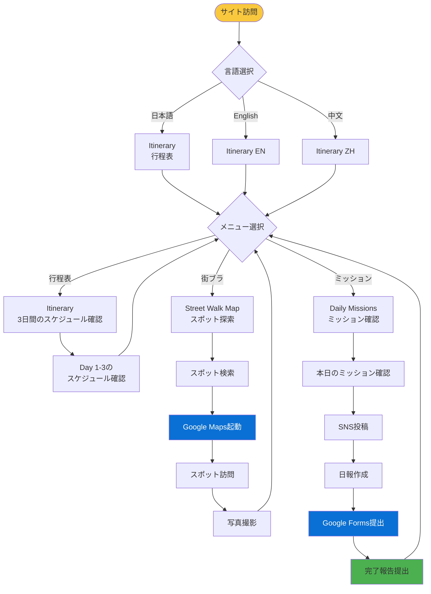
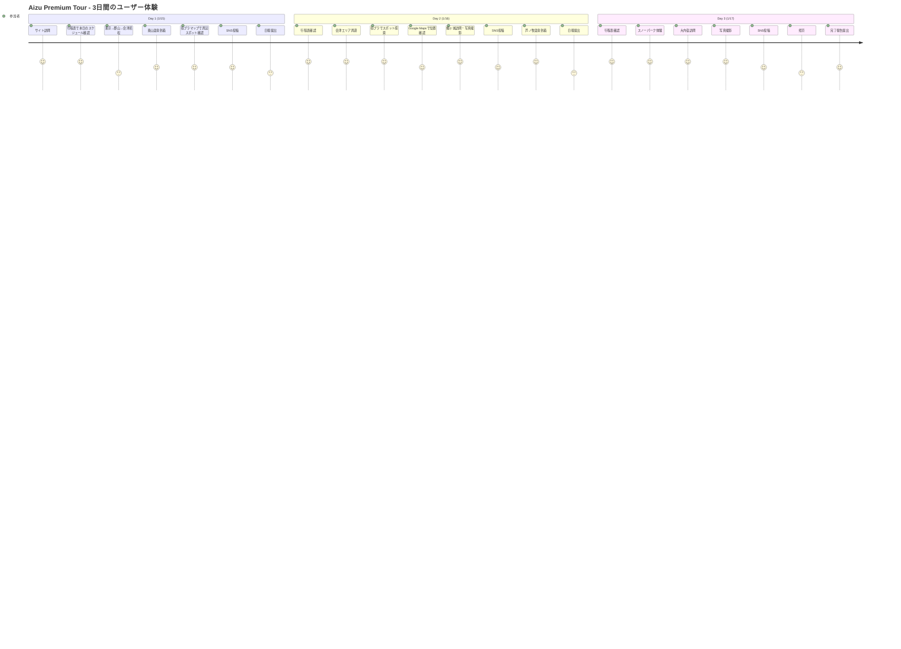
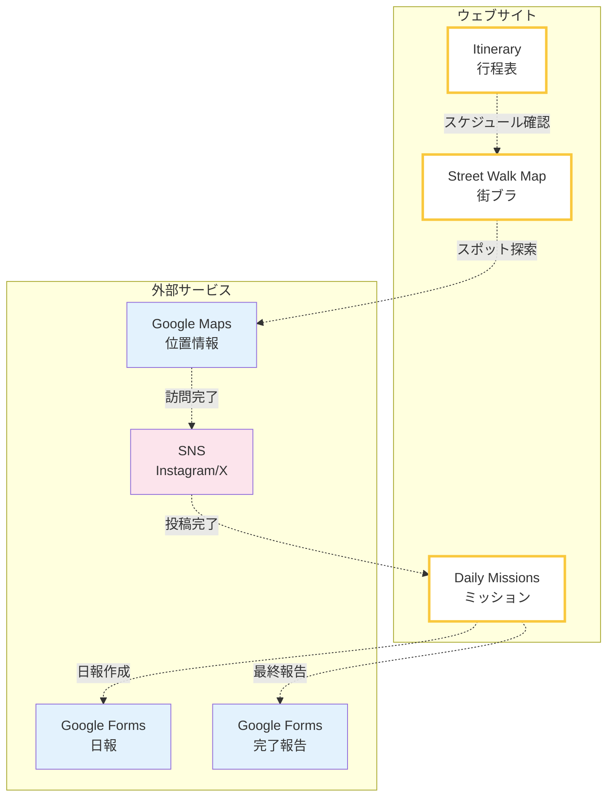

# Aizu Premium Tour - ユーザージャーニーマップ

## ページ遷移フロー

```mermaid
flowchart TD
    Start([サイト訪問]) --> LangSelect{言語選択}
    LangSelect -->|日本語| IndexJA[Itinerary<br/>行程表]
    LangSelect -->|English| IndexEN[Itinerary EN]
    LangSelect -->|中文| IndexZH[Itinerary ZH]

    IndexJA --> Menu{メニュー選択}
    IndexEN --> Menu
    IndexZH --> Menu

    Menu -->|行程表| Index[Itinerary<br/>3日間のスケジュール確認]
    Menu -->|街ブラ| StreetWalk[Street Walk Map<br/>スポット探索]
    Menu -->|ミッション| Missions[Daily Missions<br/>ミッション確認]

    Index --> CheckSchedule[Day 1-3の<br/>スケジュール確認]
    CheckSchedule --> Menu

    StreetWalk --> SearchSpot[スポット検索]
    SearchSpot --> OpenMaps[Google Maps起動]
    OpenMaps --> Visit[スポット訪問]
    Visit --> TakePhoto[写真撮影]
    TakePhoto --> Menu

    Missions --> CheckMission[本日のミッション確認]
    CheckMission --> SNSPost[SNS投稿]
    SNSPost --> DailyReport[日報作成]
    DailyReport --> SubmitForm[Google Forms提出]
    SubmitForm --> Complete[完了報告提出]
    Complete --> Menu

    style Start fill:#f9c83d
    style Complete fill:#4caf50
    style OpenMaps fill:#0b70d6,color:#fff
    style SubmitForm fill:#0b70d6,color:#fff
```

## ユーザージャーニー（3日間）

```mermaid
journey
    title Aizu Premium Tour - 3日間のユーザー体験
    section Day 1 (1/15)
        サイト訪問: 5: 参加者
        行程表で本日のスケジュール確認: 5: 参加者
        東京→郡山→会津若松: 3: 参加者
        東山温泉到着: 4: 参加者
        街ブラマップで周辺スポット確認: 4: 参加者
        SNS投稿: 4: 参加者
        日報提出: 3: 参加者
    section Day 2 (1/16)
        行程表確認: 5: 参加者
        会津エリア周遊: 5: 参加者
        街ブラでスポット探索: 5: 参加者
        Google Mapsで位置確認: 4: 参加者
        鶴ヶ城訪問・写真撮影: 5: 参加者
        SNS投稿: 4: 参加者
        芦ノ牧温泉到着: 5: 参加者
        日報提出: 3: 参加者
    section Day 3 (1/17)
        行程表確認: 5: 参加者
        スノーパーク体験: 5: 参加者
        大内宿訪問: 5: 参加者
        写真撮影: 5: 参加者
        SNS投稿: 4: 参加者
        帰京: 3: 参加者
        完了報告提出: 4: 参加者
```

## 詳細ユーザージャーニーフロー

```mermaid
flowchart LR
    subgraph 事前準備
        A1[サイト訪問] --> A2[言語選択]
        A2 --> A3[Itinerary確認]
        A3 --> A4[3日間の全体像把握]
    end

    subgraph Day1-3ループ
        B1[本日のスケジュール確認] --> B2[Street Walk Map]
        B2 --> B3[訪問スポット選定]
        B3 --> B4[Google Maps起動]
        B4 --> B5[スポット訪問]
        B5 --> B6[写真撮影]
        B6 --> B7[SNS投稿]
        B7 --> B8[Daily Missions確認]
        B8 --> B9[日報フォーム提出]
    end

    subgraph 最終日
        C1[完了報告フォーム] --> C2[3日間の振り返り]
        C2 --> C3[提出完了]
    end

    A4 --> B1
    B9 --> B1
    B9 --> C1

    style A1 fill:#f9c83d
    style C3 fill:#4caf50
```

## 主要タッチポイント

```mermaid
graph TD
    subgraph ウェブサイト
        P1[Itinerary<br/>行程表]
        P2[Street Walk Map<br/>街ブラ]
        P3[Daily Missions<br/>ミッション]
    end

    subgraph 外部サービス
        E1[Google Maps<br/>位置情報]
        E2[Google Forms<br/>日報]
        E3[Google Forms<br/>完了報告]
        E4[SNS<br/>Instagram/X]
    end

    P1 -.スケジュール確認.-> P2
    P2 -.スポット探索.-> E1
    E1 -.訪問完了.-> E4
    E4 -.投稿完了.-> P3
    P3 -.日報作成.-> E2
    P3 -.最終報告.-> E3

    style P1 fill:#fff,stroke:#f9c83d,stroke-width:3px
    style P2 fill:#fff,stroke:#f9c83d,stroke-width:3px
    style P3 fill:#fff,stroke:#f9c83d,stroke-width:3px
    style E1 fill:#e3f2fd
    style E2 fill:#e3f2fd
    style E3 fill:#e3f2fd
    style E4 fill:#fce4ec
```
